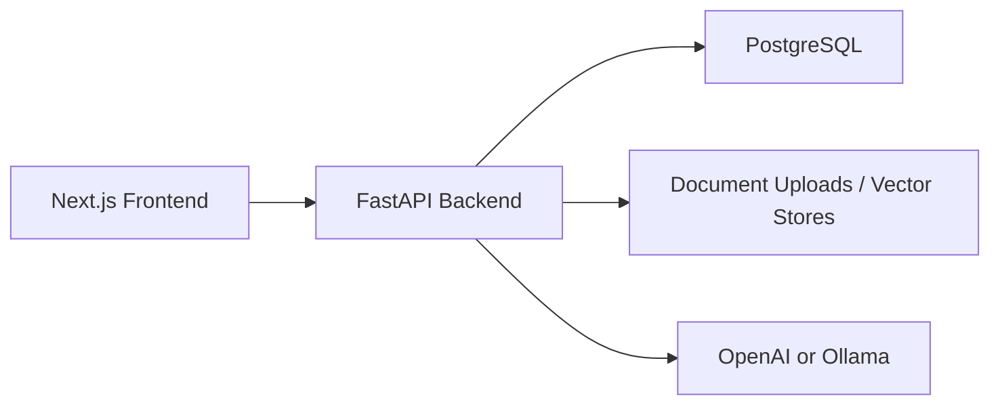

# CreatorAI

CreatorAI is a full-stack AI application for building, configuring, and deploying custom AI agents with a clean web interface.

It combines a `Next.js` frontend with a `FastAPI` backend and supports workflows such as:

- creating and managing AI agents
- chatting with custom agents
- uploading knowledge files for retrieval
- generating API keys for external integrations
- browsing agent templates and marketplace-style experiences
- experimenting with local or hosted model backends

## Highlights

- full-stack AI product architecture with `FastAPI` and `Next.js`
- custom agent creation, chat, and document-based workflows
- public API support for integrating agents into external apps
- local model support through `Ollama`
- modular foundation for marketplace, tooling, and media features

## Stack

- Frontend: `Next.js`, `React`, `TypeScript`, `Tailwind CSS`
- Backend: `FastAPI`, `SQLAlchemy`, `PostgreSQL`
- AI tooling: `OpenAI`, `LangChain`, `LangGraph`, `FAISS`, `Ollama`
- Local development: `Docker Compose`

## Project Structure

- `frontend/` - web UI
- `backend/` - API, auth, agent orchestration, document processing
- `docker-compose.yml` - local development stack
- `SIMPLE_SETUP.md` - quick start guide

## Architecture

## Quick Start

1. Copy the example environment files.
2. Set your API keys and app secrets.
3. Start the stack with Docker.
4. Open the frontend in your browser.

See [SIMPLE_SETUP.md](./SIMPLE_SETUP.md) for the fastest setup path.

## Notes

- This repository is intended as a portfolio and development project.
- Example environment files are included, but real secrets are not committed.
- Public-facing defaults have been cleaned to avoid exposing private deployment endpoints.
